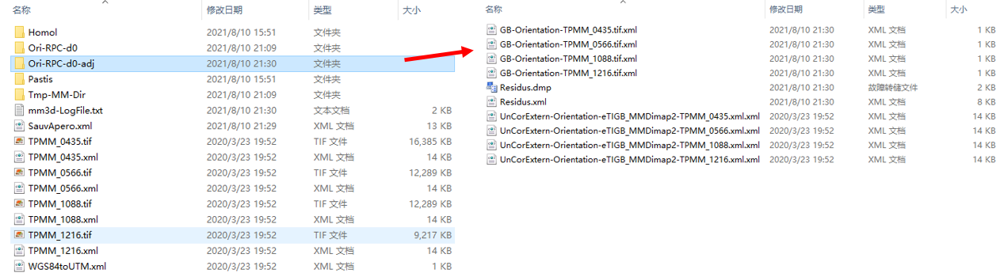

# micmac-satellite_example
Process small satellite images with an open-source software: `MicMac`

# Prepare
* [MicMac](https://micmac.ensg.eu/index.php/Install_MicMac_Windows)

* [Sample data]([https://drive.google.com/uc?id=18hmQL5kIqhcnR5ahp8IUsMZxLv7jvjgB])
> _I installed the MicMac on Windows, users can install it either on Ubuntu or Windows._

__*The dataset consists of:*__
* 4 images (tif)
* 4 corresponding RPCs (xml)
* _WGS84toUTM.xml_ with the definition of a projection coordinate system (proj4 format) 


__*The dataset:*__ 


# Process
In this project, I installed the MicMac in miniconda's virtual environment. First, activate my env, then you can check the MicMac with `mm3d`, like this:


## 1. Extract SIFT tie-points
* __computation strategy:__ there exist several predefined strategies to compute tie-points: `Line`, `All`, `MulScale`, `File`. We will use the `All` strategy where tie-points are searched between all possible pairs. Refer to MicMac documentation for the other modes.

* __image resolution:__ tie-points extraction is very costly, and to limit the computation time we usually downsampled the images; in this example, indicate resolution of `-1` which means full-resolution images; otherwise, if set to, e.g., `2000`, the images will be downsampled such that the larger image dimension (typically the width) will have `2000` pixels; the other dimension will have a size that is proportionally smaller.

* __ExpTxt=1:__ the extracted tie-points will be saved in a text format (as opossed to the default dat format).

* __results:__ tie-points are stored in the `Homol` directory. For instance, tie-points correponding to image `Im1.tif` will be stored in `Homol/PastisIm1.tif/` directory. If `Im1.tif` overlaps with `Im2.tif` and `Im3.tif`, their tie-points will be stored in `Homol/PastisIm1.tif/Im2.tif.dat` and `Homol/PastisIm1.tif/Im3.tif.dat`, respectively. If you chose to export in the text format, the dat extension will be replaced with `txt`.  

_Note: Intermediary results are stored in the `Pastis` directory. It takes a significant amount of space and is not used at later processing stages, therefore you may delete it._     
___
**-->Start with this:**
```
mm3d Tapioca All .*tif -1 ExpTxt=1 @ExitOnBrkp
```
   

_Here is the directory:_


## 2. RPC-bundle adjustment

### Read the RPCs in DIMAP format
This function reads the DIMAP format RPCs and converts it to a MicMac format. Several parameters are specified here:  
* `(.*).tif` this is the pattern of input images (note the dot preceding the star which is the posix convention)

* `\$1.xml` is the corresponding pattern of RPC files; I use here a regular expression that associates the image name with its corresponding RPC file name; you may also run the command independently for each image if you're not familiar with regular expressions;

* `RPC-d0` is the directory name where the converted files will be stored; it will serve as input in the following step, i.e., the bundle adjustment;

* `Degre=0`, the degree of the polynomial correction;

>By choosing a zero-degree polynomial we will correct the satellite's geolocalisation by modelling a 3D image shift.

* `ChSys=WGS84toUTM.xml` definition of the projection coordinate sytem; MicMac expects that the processing coordinate frame is euclidean and all three coordinates have the same unit. The RPCs are expressed in geographical coordinates which are neither euclidean, nor unique in terms of units. To overcome that, MicMac will transfer, on the fly, the RPCs to a user-defined coordinate system, in this exemple defined in the `WGS84toUTM.xml` file. The definition of the coordinate system follows the `proj4` library convention. You can retrieve the code corresponding to the coordinate frame of your interest from `https://spatialreference.org/`    

**-->Then,**
```
mm3d Convert2GenBundle "(.*).tif" "\$1.xml" RPC-d0 ChSys=WGS84toUTM.xml Degre=0  @ExitOnBrkp
```   

___
_This step creates a new folder `Ori-RPC-d0`, it includes 8 files:_


___   
### Run the adjustment

The input parameters:
* `RPC-d0` is the folder with the initial geolocalisation

* `RPC-d0_adj` is the folder where the adjusted geoloc is saved

* `ExpTxt=1` indicates that tie-points are stored in text format  

__-->Next,__  
```
mm3d Campari ".*tif" RPC-d0 RPC-d0-adj ExpTxt=1 @ExitOnBrkp
```


   
___

One way to asses the quality of the adjustment is to look at the tie-points residual (for more sophisticated quality estimates see `MMTestOrient` in MicMac documentation).  
The bundle adjustment is carried out in several iterations. Let's look at image TPMM_0435.tif in the last iteration:
>RES:[TPMM_0435.tif][g] ER2 0.24636 Nn 100 Of 11753 Mul 5171 Mul-NN 5171 Time 1.15821


* `0.24636` pixels is the mean residual calculated over all tie-points (i.e.,  _σ_  of the bundle)

* `Nn 100` means that 100 %  of tie-points were considered as inliers

* `11753` there were as many tie-points found

* `5171` there were as many multiple tie-points found (out of the `11753`), i.e., tie-points observed in at least 3 images;  

_Now, the directory:_


___  

## 3.Surface reconstruction
We will now calculate the surface with the semi-global dense image matching [Deseilligny & Paparoditis, 2006].
>Deseilligny, M. and Paparoditis, N., 2006. A multiresolution and optimization-based image matching approach: An application to surface reconstruction from SPOT5-HRS stereo imagery. Archives of Photogrammetry, Remote Sensing and Spatial Information Sciences, 36(1/W41), pp.1-5.

### Method 1: Matching in object geometry
The computation will be carried out in the so-called terrain geometry, where the optimization is defined in the `(X,Y)` of the object space, and we are looking for the most optimal `Z`-coordinates (see Figure below). This geometry is well adapted to 2.5D surface computation. 

  
___
The input parameters are:

* `UrbanMNE` is a predefined term and it defines a number of processing parameters (e.g., low regularization, small matching wodows, terrain geometry)

* `.*tif` is the image set that will be used in the processing

* `RPC-d0-adj` is the name of the directory containing the geoloclisation

* `SzW=2` defines the matching window size, i.e., with size set to 2, the window size is `5x5`

* `Regul` is the regularization term  α ; in `UrbanMNE` it is by default set to 0.02 becase in urban zones we're typically interested in reconstructing fine details; the dataset used in this example, however, represents a smooth surface so we're just fine with a more agressive regularization; moreover, our images are quite noisy and by adding more regularization we will avoid noisy surface reconstructions;

* `DoOrtho=1`, this parameters wil force MicMac to create individual orthomosaic, i.e., rectify each image; the rectified images are stored in `Ortho-MEC-Malt/Ort_*.tif`; to create the final orthophotomap we will still need to do mosaicing with `Tawny` (later in this tutorial);

* `NbVI=2` sets the necessary minimum number of images for MicMac to compute the surface; by default the value is set to 3 which means that in areas with only two overlapping images, the surface will not be computed;

* `EZA=1`, this parameter will force the output surface raster to save the Z-coordinates in their absolute values; without explicitly forcing MicMac to do that, to avoid having to store large values inside the raster tiff, it will apply a normalisation (normalisation parameters `OrigineAlti` and `ResolutionAlti` are to be found in the accompanying xml files);

**-->Run below,**

```
mm3d Malt UrbanMNE ".*tif" RPC-d0-adj SzW=2 Regul=0.2 DoOrtho=1 NbVI=2 EZA=1 @ExitOnBrkp
```


___
_Reading the output files_  
The matching is carried out at multi-resolutions, i.e., we first calculate the surface using low resolution images (top-most level of the image pyramid), then we propagate the solution to lower levels and refine it, so long we have not reached the bottom of the image pyramid. The surface reconstructions at each level are stored inside the `MEC-Malt` directory. Here's how to decipher the files:

* `MEC-Malt/Z_Num8_DeZoom1_STD-MALT.tif` represents the surface raster at the highest resolution;

* `MEC-Malt/Z_Num8_DeZoom1_STD-MALT.xml` is its metadata file that encodes the georeferencing; let's assume you'd like to convert a pixel _(i,j)_  from its image coordinates to its georeferenced coordinates (i.e., object coordinates):

* `Z-coordinate normalised` :  $$\sum_{i,j}^{img}Z=Z\_Num\_File^{img}(i,j)$$  

* `Z-coordinate` :  $$\sum_{i,j}^{obj}Z=OrigineAlti+ResolutionAlti\cdot (i,j)$$

* `XY-coordinates` :  $(X,Y)=OriginePlani+ResolutionAlti\cdot(i,j) $

* `MEC-Malt/Masq_STD-MALT_DeZoomX.tif` is a binary mask file that is a result of your input mask (if you used one) and a mask that is automatically calculated in the matching optimisation phase;

* `MEC-Malt/Correl_STD-MALT_Num_X.tif` are the images with storing the correlation scores (it is not pure correlation, it is the correlation store after the aggregation step)

_Here is the `MEC-Malt` directory:_


___
_The `Ortho-MEC-Malt` directory:_


___
_The `Pyram` directory:_


___

#### Create a grayshaded DSM
Represent the surface in form of a grayshading. To visually asses the quality of your surface, it is much more intuitive than just looking at the depth/Z image.

**-->Run it,**
```
mm3d GrShade MEC-Malt/Z_Num8_DeZoom1_STD-MALT.tif ModeOmbre=IgnE Mask=MEC-Malt/Masq_STD-MALT_DeZoom1.tif @ExitOnBrkp
```


_The `MEC-Malt/Z_Num8_DeZoom1_STD-MALTShade.tif`,_


___

#### Generate an orthophotmap
`Tawny` will mosaic the per-image orthopĥotomosaics created in `Malt`(i.e., `Ortho-MEC-Malt/Ort_*.tif`), during matching. It will additionally perform some basic radiometry equalization. The output orthoimage is stored in `Ortho-MEC-Malt/Orthophotomosaic.tif`, and its georeferencing is stored in `Ortho-MEC-Malt/Orthophotomosaic.twf`.

```
mm3d Tawny Ortho-MEC-Malt/ @ExitOnBrkp
```


_Now, we can see the `Ortho-MEC-Malt/Orthophotomosaic.tif`,_


____

### Method2: Multiview matching in image geometry and fusion
The computation will be carried out in the image geometry, where the optimization is defined in the `(x,y)` of the image space, and we are looking for the most optimal `depths` (see Figure below). This geometry is well adapted to true 3D surface reconstruction. Because the individual reconstructions are computed in image coordinate frames, a fusion will but carried out at the end.


___

The multiview pipeline is as follows [Rupnik et al., 2018]:

1. Extract tie-points and do RPC-bundle adjustement (done previously)
2. Do N per-stereo (or per-M image as we are not bound by the number of images) dense matching (`Malt GeomImage`)
3. Transform the N depth maps to a common coordinate frame (`NuageBascule`)
4. Fuse the N depth maps into one (`SMDM`)

___
> Rupnik, E., Pierrot-Deseilligny, M. and Delorme, A., 2018. 3D reconstruction from multi-view VHR-satellite images in MicMac. ISPRS Journal of Photogrammetry and Remote Sensing, 139, pp.201-211.

#### Do two per-triplet image matching

We will compute two surfaces using two different subsets of the images.

Input parameters:

* `GeomImage` is a predefined term and it defines a number of processing parameters (e.g., low regularization, small matching wodows, image geometry)

* `TPMM_(0435|0566|1088).*tif` is the image set that will be used in the processing; in this example it is an image triplet; we take 3 **consecutive images** to make sure that the  $\frac{B}{H}$  ratios in the set are relatively small

* `RPC-d0-adj` is the name of the directory containing the geolocalisation

* `Master=TPMM_0566.tif` is the master image, i.e., the optimization is defined over each pixel of that image

* `SzW=2 and Regul=0.2`, similarily to Method1, we add regularization and use bigger correlation windows because: (1) the geometry of the surface is smooth (i.e., no discontinuities), and (2) the images are quiet noisy;

* `NbVI=2` sets the necessary minimum number of images for MicMac to compute the surface; by default the value is set to 3 which means that in areas with only two overlapping images, the surface will not be computed; 

**-->First run this,**

```
# The first triplet
mm3d Malt GeomImage "TPMM_(0435|0566|1088).*tif" RPC-d0-adj Master=TPMM_0566.tif SzW=1 Regul=0.1 NbVI=2 ZPas=1 @ExitOnBrkp
```


___

_This may take almost 10 minutes, which is the most time-consuming in the workflow_

> PID : 37800 ;   [Beginning at ] Thu Aug 12 17:21:47 2021
 PID : 37800 ;   [Ending correctly at] Thu Aug 12 17:30:53 2021
___

_Then, you can get the `MM-Malt-Img-TPMM_0255` directory,_


___

_In this directory, there are **113** new files:_


___

**-->Then, do this again with different parameters,**
```
# the second triplet
mm3d Malt GeomImage "TPMM_(0566|1088|1216).*tif" RPC-d0-adj Master=TPMM_1088.tif SzW=1 Regul=0.1 NbVI=2 ZPas=1   @ExitOnBrkp
```  


___

_This also takes about 10 minutes._

>PID : 35656 ;   [Beginning at ] Thu Aug 12 17:37:53 2021
 PID : 35656 ;   [Ending correctly at] Thu Aug 12 17:47:21 2021
 ___

 _After that, you get the `MM-Malt-Img-TPMM_1088` folder,_


___
_In the directory, there are **113** files:_


___

#### Transform the depth maps to a common coordinate frame

* The  $1^{st}$  command `Malt` `UrbanMNE` does image matching in ground geometry (we've used it before), but since we indicate `DoMEC=0` it will not calculate the matching, all it will do is to create metadata defining the coordinate frame of the ground geometry. The output, as before, is stored in `MEC-Malt` folder;

* The  $2^{nd}$  command NuageBascule will apply the transformation; the parameters are:

    * `MM-Malt-Img-TPMM_0566/NuageImProf_STD-MALT_Etape_8.xml` is the metadata file defining the input coordinate frame
    * `MEC-Malt/NuageImProf_STD-MALT_Etape_8.xml` is the metadata file defining the target coordinate frame (i.e., it is the terrain geometry)
    * `Fusion/DSM_Tri1.xml` is the output metadata file, i.e., the input file transformed to the target coordinate frame; it will be accompagned by several other files containing the surface itself, the mask and the correlation image (see the inside of the `Fusion` folder); 

```
# define the common frame
mm3d Malt UrbanMNE ".*tif" RPC-d0-adj DoMEC=0  @ExitOnBrkp

# create a directory that will store the fused surface
mkdir Fusion

# do 3D spatial similarity of the first triplet depth map
mm3d NuageBascule MM-Malt-Img-TPMM_0566/NuageImProf_STD-MALT_Etape_8.xml MEC-Malt/NuageImProf_STD-MALT_Etape_8.xml Fusion/DSM_Tri1.xml @ExitOnBrkp

# do 3D spatial similarity of the second triplet depth map
mm3d NuageBascule MM-Malt-Img-TPMM_1088/NuageImProf_STD-MALT_Etape_8.xml MEC-Malt/NuageImProf_STD-MALT_Etape_8.xml Fusion/DSM_Tri2.xml @ExitOnBrkp
```  

___

_Make Fusion directory,_


___
_The `Fusion` directory:_


___

#### Fuse the individual depth maps

The fusion takes all the surfaces specified by the regular expression and merges it. The fusion takes into account the correlation images and treats it as confidence maps.

Input parameters:

* `Fusion/DSM_Tri.*xml` the subset of surfaces that will be merged;

Tha result is saved to `Fusion/Fusion_Prof.tif`, there is a corresponding mask and a correlation map named with `_Mask` and `Correl` postfixes, respectively.

**-->Next,**
```
mm3d SMDM Fusion/DSM_Tri.*xml  @ExitOnBrkp
```


___

_This generates 6 new files:_


___

#### Visualise in grayshade and export to ply

```
mm3d GrShade Fusion/Fusion_Prof.tif Out=Fusion/Fusion_GShade.tif ModeOmbre=IgnE @ExitOnBrkp

# export to ply
mm3d Nuage2Ply Fusion/Fusion.xml Out=Fusion.ply
```

_1. Generate `Fusion_GShade.tif`_


___

___

_`Fusion_GShade.tif` in this **QGIS**_


___

_2. Generate `Fusion.ply`_


___

___

_Here, I show this point cloud in **CloudCampare**:_


___


_More over,_
```
mm3d GrShade MM-Malt-Img-TPMM_1088/Z_Num8_DeZoom1_STD-MALT.tif Mask=MM-Malt-Img-TPMM_1088/Masq_STD-MALT_DeZoom1.tif  ModeOmbre=IgnE @ExitOnBrkp
```


___

_I put this `Z_Num8_DeZoom1_STD-MALTShade.tif` in **QGIS**:_


___

To here, the main procedure to deal with satellite images is finished, this may be helpful for some 3D reconstruction works! :grin: